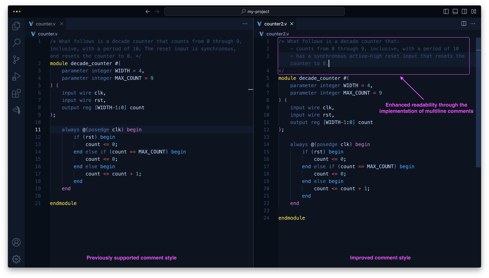

<!-- truncate -->
We are happy to announce that **RapidGPT v1.35** is now available on the [VS Code marketplace](https://marketplace.visualstudio.com/items?itemName=PrimisAI.rapidgpt). Updating to the latest version is seamless: if extension auto-update is enabled, the update will occur automatically when you reopen VS Code. For those who prefer manual updates, please refer to this guide on [how to update an extension manually](https://code.visualstudio.com/docs/editor/extension-marketplace#_update-an-extension-manually).

:::tip Special Offer

**Unleash the Potential of GenAI for Hardware Design with this Limited Exclusive Offer**

PrimisAI is thrilled to present **a lifetime subscription to RapidGPT for just $9.99/month**, available to the first 1,000 PRO subscribers! Lock in this rate and enjoy all future features without worrying about price hikes&mdash;save $60.00 per month on our PRO plan.

[**Click here**](https://getrapidgpt.primis.ai/) to begin your 2-week trial and lock in your lifetime subscription at the exceptional rate of $9.99/month. Remember to apply the promo code **RGPT10** for monthly billing or **RGPT120** for an annual plan at checkout.

This offer is available until December 31, 2024.

:::

## New Features and Highlights

### Quick Command Selection Panel
In this release, we unveil a novel quick command selection panel, strategically located beneath the Chat panel. This new component empowers users to swiftly access specific functions directly, bypassing the need for navigating through the VS Code Command Palette. The video below showcases how users can seamlessly incorporate AI-generated comments into a Verilog file utilizing RapidGPT's [AutoComment](/docs/user-guide/rapidgpt-vscode/autocomment) feature, all achievable through a mere single click.

<video width="100%" height="auto" preload="auto" autoPlay muted loop playsInline>
  <source src="/videos/blog/v1.35/command-panel.mp4"/>
</video>

### Support for Multiline Comments
Clarity is key when navigating complex challenges. In alignment with this principle, we have now extended full support for multiline comments within [code autocompletion](/docs/user-guide/rapidgpt-vscode/code-assistant). Users can now harness the versatility of markdown formatting within Verilog comments, thus enhancing the readability and maintainability of their code. This enhancement taps into the full potential of RapidGPT's predictive capabilities for HDL code, ensuring a smoother and more intuitive coding experience.

### Improved Conversation Scopes Panel
The Conversation Scopes panel is essential for managing multiple conversations related to various facets of the overall design. With this update, the panel has been revamped to offer an improved look and feel, featuring distinct icons that signify scope types (e.g., files or individual modules). Moreover, it has been made interactive, enabling users to navigate through their source code by selecting conversation anchors.
<video width="100%" height="auto" preload="auto" autoPlay muted loop playsInline>
  <source src="/videos/blog/v1.35/improved-conversation-scopes.mp4"/>
</video>

## Bug Fixes and Other Improvements
This release introduces a series of bug fixes and improvements, including:
- RapidGPT has been updated to store file paths in chat history using their relative paths, effectively resolving issues related to managing files with identical names located in distinct directories.
- Enhancements in conversation management have been made, addressing bugs that previously hindered the deletion of chat histories under specific conditions.
- Refinements to the code autocompletion functionality have been implemented, eliminating unintended activations of RapidGPT during cursor navigation within the source code.