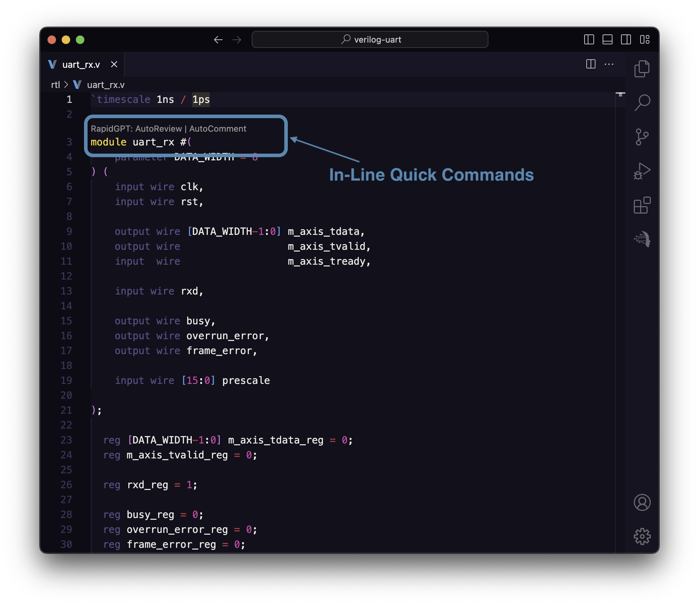
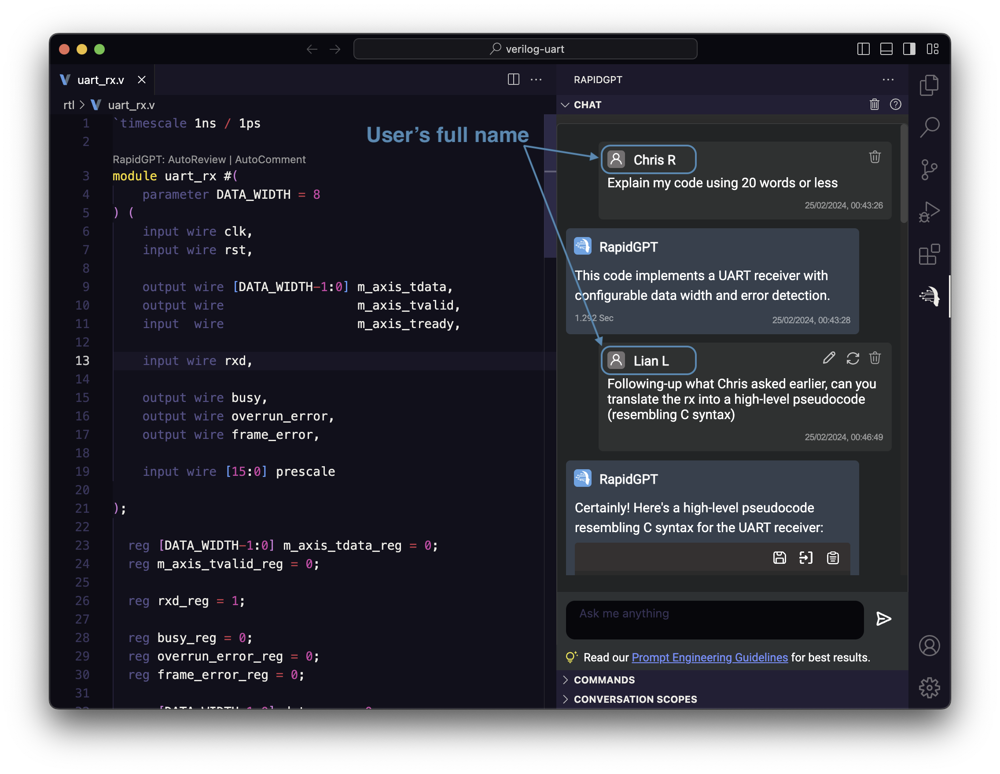
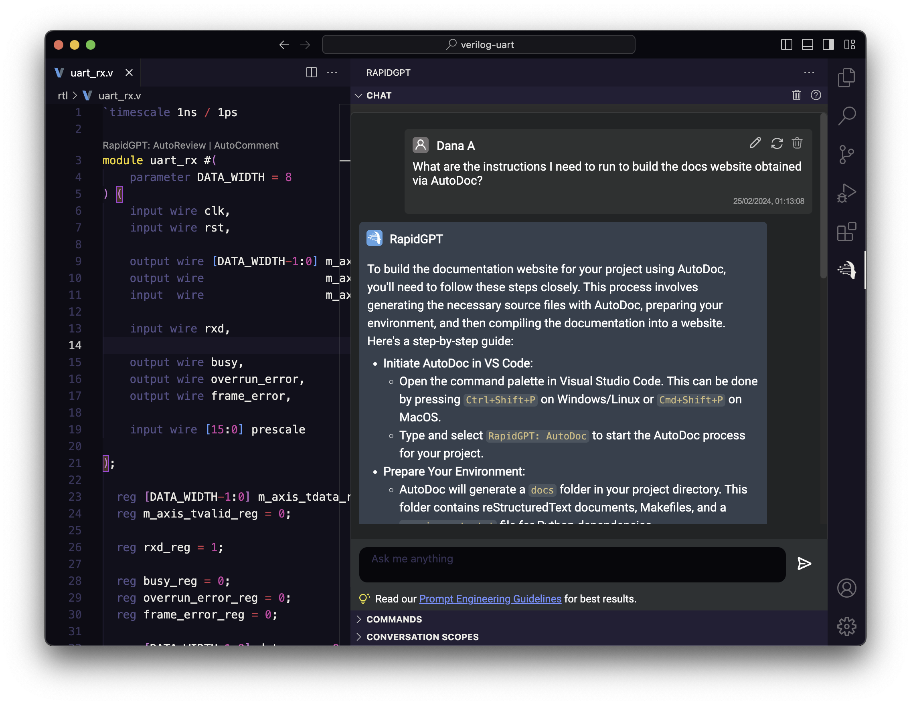

<!-- truncate -->

We are happy to announce that **RapidGPT v1.36** is now available on the [VS Code marketplace](https://marketplace.visualstudio.com/items?itemName=PrimisAI.rapidgpt). Updating to the latest version is seamless: if extension auto-update is enabled, the update will occur automatically when you reopen VS Code. For those who prefer manual updates, please refer to this guide on [how to update an extension manually](https://code.visualstudio.com/docs/editor/extension-marketplace#_update-an-extension-manually).

:::tip Special Offer

**Unleash the Potential of GenAI for Hardware Design with this Limited Exclusive Offer**

PrimisAI is thrilled to present **a lifetime subscription to RapidGPT for just $9.99/month**, available to the first 1,000 PRO subscribers! Lock in this rate and enjoy all future features without worrying about price hikes&mdash;save $60.00 per month on our PRO plan.

[**Click here**](https://getrapidgpt.primis.ai/) to begin your 2-week trial and lock in your lifetime subscription at the exceptional rate of $9.99/month. Remember to apply the promo code **RGPT10** for monthly billing or **RGPT120** for an annual plan at checkout.

This offer is available until December 31, 2024.

:::

## New Features and Highlights

### In-Line Quick Commands

Building on the efficiency of our [Quick Commands Panel](/blog/2024/02/06/rapidgpt-vscode-v1.35), we're introducing in-line quick commands. This exciting new feature empowers users to execute actions directly on specific modules within their code, streamlining the workflow and keeping the focus where it matters most.

### Updated IP Catalog

:::info Tips & Tricks

Unsure whether our catalog includes the IP you're searching for? Just ask RapidGPT by saying "**Show me your IP catalog**" to receive a comprehensive list of all supported IPs.

:::

We've expanded the selection of IPs available in our catalog. With this update, pro users can now effortlessly instantiate over 30 distinct Xilinx IPs using natural language. Additionally, users can directly discuss the documentation of these IPs within the chat interface. Here's a list of the newly added components:

| Component                      | Category                 |
|--------------------------------|--------------------------|
| AMM Master Bridge              | Adders & Subtractor      |
| AMM Slave Bridge               | Conversion, CORDIC       |
| AXI EPC                        | Divider                  |
| AXI GPIO                       | Floating Point           |
| AXI HWICAP                     | Multiplier               |
| AXI IIC                        | Multiplier               |
| AMM Master Bridge              | AXI Low Speed Peripheral |
| AMM Slave Bridge               | AXI Low Speed Peripheral |
| AXI EPC                        | AXI Low Speed Peripheral |
| AXI GPIO                       | AXI Low Speed Peripheral |
| AXI HWICAP                     | AXI Low Speed Peripheral |
| AXI IIC                        | AXI Low Speed Peripheral |
| AXI Interrupt Controller       | AXI Low Speed Peripheral |
| AXI CAN                        | AXI Low Speed Peripheral |
| AXI Quad SPI                   | AXI Low Speed Peripheral |
| AXI TFT Controller             | AXI Low Speed Peripheral |
| AXI Timebase Watchdog Timer    | AXI Low Speed Peripheral |
| AXI Timer                      | AXI Low Speed Peripheral |
| AXI UART16550                  | AXI Low Speed Peripheral |
| AXI Uartlite                   | AXI Low Speed Peripheral |
| CANFD                          | AXI Low Speed Peripheral |
| AHB-Lite to AXI Bridge         | Interconnect             |
| AXI AHBLite Bridge             | Interconnect             |
| AXI APB Bridge                 | Interconnect             |

### Enhanced Chat Panel

The updated chat panel now displays users' full names alongside their messages, enhancing clarity and context. This feature proves especially valuable in version control settings, where RapidGPT facilitates collaborative efforts by enabling users to accurately track their interactions with RapidGPT.

### Improved Self-Awareness

With the latest release, RapidGPT has been upgraded to possess a deeper understanding of its functionalities, ensuring you receive more comprehensive and accurate responses. Now, you can directly inquire about RapidGPT's key features within the chat panel. Curious about how to operate [AutoDoc](https://docs.primis.ai/user-guide/rapidgpt-vscode/autodoc)? Just ask RapidGPT, and it will seamlessly guide you through the process.

## Bug Fixes and Other Improvements

This release introduces a series of bug fixes and improvements, including:

- **Dynamic input box adjustments**: The prompt input box now dynamically adjusts vertically to accommodate more content, enhancing readability and comfort during text entry.
- **Customizable iteration cap for AutoReview**: With the new `Autoreview Max Iterations` setting, users can now set a custom iteration limit in [AutoReview](https://docs.primis.ai/user-guide/rapidgpt-vscode/autoreview), specifically addressing and mitigating the occurrence of `429` errors.