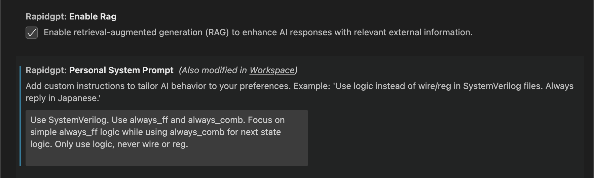

<!-- truncate -->

We are excited to announce the October Release for two of our leading AI tools! Whether you're an individual developer using our RapidGPT VS Code extension or part of an enterprise working with Magnus, these updates bring significant enhancements that will boost your productivity and AI-driven workflows.

For our **RapidGPT** users, **RapidGPT v1.44** is now live on the [VS Code marketplace](https://marketplace.visualstudio.com/items?itemName=PrimisAI.rapidgpt)! Updating to the latest version is seamless: if extension auto-update is enabled, the update will occur automatically when you reopen VS Code. For those who prefer manual updates, please refer to this guide on [how to update an extension manually](https://code.visualstudio.com/docs/editor/extension-marketplace#_update-an-extension-manually).

For enterprises, **Magnus v24.10** brings significant enhancements that simplify how your team works with AI. We are ensuring that every response and code suggestion reflects your unique processes and specifications, keeping your projects on the cutting edge of innovation.

:::note Research Spotlight

At **PrimisAI**, we are pioneering the foundation for **GenEDA** through cutting-edge research. Visit our [Papers](/papers) page to learn more about our latest breakthroughs.

:::

## Extension - New Features and Highlights

### Interact with Magnus
Enterprise customers can now engage with their Private Assistant, Magnus, through the VS Code Chat window. Feel free to ask Magnus about its features!

<video width="100%" height="auto" preload="auto" autoPlay muted loop playsInline>
  <source src="/videos/blog/v1.44/magnus-introduction.mp4"/>
</video>

### Chat Window Compatibility
We've added the ability to interact with **Text and Markdown files** directly in the chat, making it easy to work with design specifications, documentation, and more.

<video width="100%" height="auto" preload="auto" autoPlay muted loop playsInline>
  <source src="/videos/blog/v1.44/specs-md-file.mp4"/>
</video>

### Local Files I/O

**File Upload**: You can now provide your AI assistant with context via uploading files.

<video width="100%" height="auto" preload="auto" autoPlay muted loop playsInline>
  <source src="/videos/blog/v1.44/file-attachment.mp4"/>
</video>

**Mentioning Files in Conversation**: We've also added the option to mention specific files in your project folder. Simply, prefix the file name with "./".

<video width="100%" height="auto" preload="auto" autoPlay muted loop playsInline>
  <source src="/videos/blog/v1.44/local-file-readme.mp4"/>
</video>

### Settings Update
**RAG Toggle**: A new toggle option is available in the extension, allowing Enterprise users to include or exclude RAG as needed.

**Personal System Prompt**: We've also renamed the "Custom Prompt" feature (released in v1.43) to "**Personal System Prompt**".

## Magnus Private RAG - New Features and Highlights

### RAG Dashboard
The Magnus Private Cloud RAG Dashboard now provides more detailed and timely status updates when modifications are made to the RAG system.

### `.SystemPrompt` File
Enterprise users can now configure a .SystemPrompt file, enabling company-wide preferences and customization for Magnus.

### Improved RAG Awareness
Magnus has improved its understanding of the RAG database, and now provides better assistance with RAG lookup.

