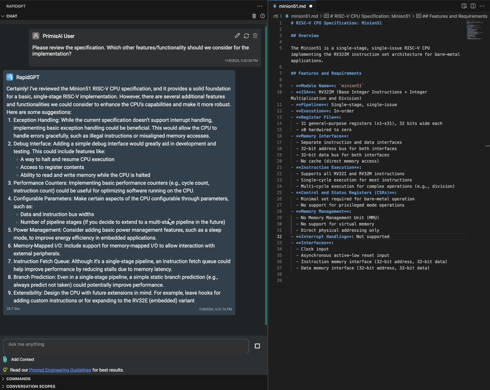
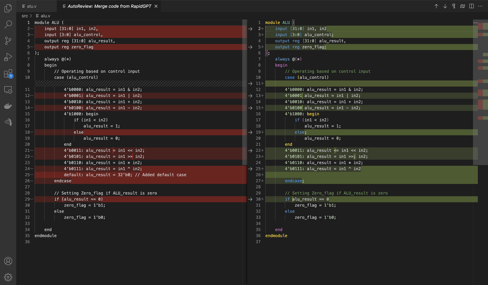

<!-- truncate -->

The November Release for **RapidGPT** and **Magnus** (Enterprise Customers) is here! This month we've leveled up the VS Code Extension with new features to bring a more immersive environment between you and your personal hardware design assistant!

For our **RapidGPT** users, **RapidGPT v1.47** is now live on the [VS Code marketplace](https://marketplace.visualstudio.com/items?itemName=PrimisAI.rapidgpt)! Updating to the latest version is seamless: if extension auto-update is enabled, the update will occur automatically when you reopen VS Code. For those who prefer manual updates, please refer to this guide on [how to update an extension manually](https://code.visualstudio.com/docs/editor/extension-marketplace#_update-an-extension-manually).

For **Enterprise Customers**, contact us today to learn more on how you can enable your hardware engineers with **Magnus v24.11**, the ultimate hardware AI assistant that understands your company hardware data and documentation in a private setting. 

:::note Research Spotlight

At **PrimisAI**, we are pioneering the foundation for **GenEDA** through cutting-edge research. Visit our [Papers](/papers) page to learn more about our latest breakthroughs.

:::

## Extension - New Features and Highlights

## Chat about (virtually) any file
Previously, the chat window supported Verilog and VHDL files. We've extended the use to any file type now! From **Python** scripts used for hardware modeling or simulation to design specifications written in **.txt** or **.md** files, you can now interact with any text-based file via the chat window.

## Local File Retrieval Adjustments
Accessing local files via Chat is more convenient than ever! File referencing has been adjusted to be relative to the opened folder path, rather than based on the opened file. 

<video width="100%" height="auto" preload="auto" autoPlay muted loop playsInline>
  <source src="/videos/blog/v1.47/local-file-retrieval.mp4"/>
</video>

## Improved AutoReview
AutoReview, powered by GenAI, optimizes your Verilog, SystemVerilog, and VHDL files by not only addressing syntax but also suggesting valuable improvements. With this release, experience faster convergence times and smarter, high-quality recommendations to elevate your code quality!

## Bug Fixes and Other Improvements

Higher Quality Error Reports: Errors seen on the extension are more elaborate, highlighting and pinpointing issues easier.

